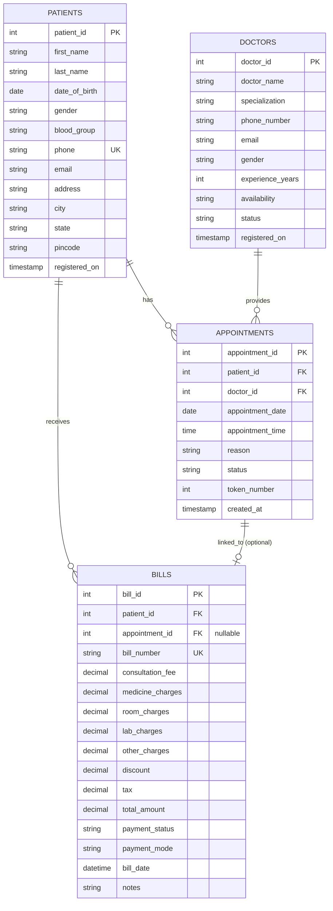

# Entity-Relationship Diagram (ERD) Details
## Hospital Management System Database Schema

**Project Name:** Hospital Management System (Rukmani Birla Hospital - RBH)  
**Database Name:** hospital_db  
**System Type:** Hospital Appointment, Patient, Doctor, and Billing Management System  
**Created:** 2026  

---

## Table of Contents
1. [Database Overview](#database-overview)
2. [Entities](#entities)
3. [Entity Relationships](#entity-relationships)
4. [Relationship Cardinality](#relationship-cardinality)
5. [Detailed Entity Specifications](#detailed-entity-specifications)
6. [ERD Diagram](#erd-diagram)
7. [Keys and Constraints](#keys-and-constraints)
8. [Indexing Strategy](#indexing-strategy)
9. [Data Integrity Rules](#data-integrity-rules)

---

## Database Overview

The Hospital Management System database consists of **4 main entities**:
- **Patients** - Patient information and demographics
- **Doctors** - Doctor profiles and specialization details
- **Appointments** - Appointment scheduling and management
- **Bills** - Billing and payment information

This system supports core hospital operations including patient registration, doctor management, appointment scheduling, and billing operations.

---

## Entities

### 1. PATIENTS Table
**Purpose:** Stores complete patient demographic and contact information

#### Attributes:
| Attribute | Data Type | Constraints | Description |
|-----------|-----------|-------------|-------------|
| patient_id | INT | PRIMARY KEY, AUTO_INCREMENT | Unique patient identifier |
| first_name | VARCHAR(50) | NOT NULL | Patient's first name |
| last_name | VARCHAR(50) | NOT NULL | Patient's last name |
| date_of_birth | DATE | NOT NULL | Patient's date of birth |
| gender | ENUM('Male', 'Female', 'Other') | NOT NULL | Gender of patient |
| blood_group | VARCHAR(5) | NULLABLE | Blood group (e.g., O+, AB-) |
| phone | VARCHAR(15) | NOT NULL, UNIQUE | Contact phone number |
| email | VARCHAR(100) | NULLABLE | Email address |
| address | TEXT | NULLABLE | Street address |
| city | VARCHAR(50) | NULLABLE | City name |
| state | VARCHAR(50) | NULLABLE | State/Province |
| pincode | VARCHAR(10) | NULLABLE | Postal code |
| registered_on | TIMESTAMP | DEFAULT CURRENT_TIMESTAMP | Registration date and time |

#### Indexes:
- `idx_phone` - Index on phone (UNIQUE constraint)
- `idx_first_name` - Index on first_name
- `idx_last_name` - Index on last_name

#### Sample Data:
```
patient_id: 1-N (Auto-incremented)
first_name: John, Mary, Alice, etc.
date_of_birth: Format YYYY-MM-DD
gender: Male, Female, Other
blood_group: O+, AB-, B+, A-, etc.
```

---

### 2. DOCTORS Table
**Purpose:** Stores doctor information and professional details

#### Attributes:
| Attribute | Data Type | Constraints | Description |
|-----------|-----------|-------------|-------------|
| doctor_id | INT | PRIMARY KEY, AUTO_INCREMENT | Unique doctor identifier |
| doctor_name | VARCHAR(100) | NOT NULL | Full name of doctor |
| specialization | VARCHAR(100) | NULLABLE | Medical specialization (e.g., Cardiology, Pediatrics) |
| phone_number | VARCHAR(20) | NULLABLE | Contact phone number |
| email | VARCHAR(100) | NULLABLE | Email address |
| gender | VARCHAR(20) | NULLABLE | Gender of doctor |
| experience_years | INT | NULLABLE | Years of medical experience |
| availability | TEXT | NULLABLE | Availability schedule/notes |
| status | VARCHAR(20) | NULLABLE | Status (e.g., Active, On Leave, Retired) |
| registered_on | TIMESTAMP | DEFAULT CURRENT_TIMESTAMP | Registration date and time |

#### Indexes:
- `idx_specialization` - Index on specialization
- `idx_phone_number` - Index on phone_number

#### Sample Data:
```
doctor_id: 1-N (Auto-incremented)
specialization: Cardiology, Orthopedics, General Medicine, Pediatrics, etc.
experience_years: 1-50
status: Active, On Leave, Part-time
```

---

### 3. APPOINTMENTS Table
**Purpose:** Stores appointment scheduling and status information

#### Attributes:
| Attribute | Data Type | Constraints | Description |
|-----------|-----------|-------------|-------------|
| appointment_id | INT | PRIMARY KEY, AUTO_INCREMENT | Unique appointment identifier |
| patient_id | INT | NOT NULL, FOREIGN KEY | Reference to patients table |
| doctor_id | INT | NOT NULL, FOREIGN KEY | Reference to doctors table |
| appointment_date | DATE | NOT NULL | Date of appointment |
| appointment_time | TIME | NOT NULL | Time of appointment |
| reason | TEXT | NULLABLE | Reason for appointment/complaint |
| status | ENUM('Scheduled', 'Completed', 'Cancelled') | DEFAULT 'Scheduled' | Appointment status |
| token_number | INT | NULLABLE | Token number for queue management |
| created_at | TIMESTAMP | DEFAULT CURRENT_TIMESTAMP | Creation date and time |

#### Foreign Keys:
- `FK_appointment_patient` - FOREIGN KEY (patient_id) REFERENCES patients(patient_id) ON DELETE CASCADE
- `FK_appointment_doctor` - FOREIGN KEY (doctor_id) REFERENCES doctors(doctor_id) ON DELETE RESTRICT

#### Indexes:
- `idx_patient_id` - Index on patient_id
- `idx_doctor_id` - Index on doctor_id
- `idx_appointment_date` - Index on appointment_date
- `idx_status` - Index on status

#### Sample Data:
```
appointment_id: 1-N (Auto-incremented)
appointment_date: Format YYYY-MM-DD
appointment_time: Format HH:MM:SS
status: Scheduled, Completed, Cancelled
token_number: 1-100 (sequential for each day)
reason: General checkup, Follow-up, Emergency, etc.
```

---

### 4. BILLS Table
**Purpose:** Stores billing and payment transaction information

#### Attributes:
| Attribute | Data Type | Constraints | Description |
|-----------|-----------|-------------|-------------|
| bill_id | INT | PRIMARY KEY, AUTO_INCREMENT | Unique bill identifier |
| patient_id | INT | NOT NULL, FOREIGN KEY | Reference to patients table |
| appointment_id | INT | NULLABLE, FOREIGN KEY | Reference to appointments table (optional link) |
| bill_number | VARCHAR(30) | NOT NULL, UNIQUE | Unique bill number (Format: RBH-BILL-YYYYMMDD-XXXX) |
| consultation_fee | DECIMAL(10,2) | DEFAULT 0.00 | Doctor consultation charges |
| medicine_charges | DECIMAL(10,2) | DEFAULT 0.00 | Medication costs |
| room_charges | DECIMAL(10,2) | DEFAULT 0.00 | Hospital room/bed charges |
| lab_charges | DECIMAL(10,2) | DEFAULT 0.00 | Laboratory test charges |
| other_charges | DECIMAL(10,2) | DEFAULT 0.00 | Miscellaneous charges |
| discount | DECIMAL(10,2) | DEFAULT 0.00 | Discount amount (absolute) |
| tax | DECIMAL(10,2) | DEFAULT 0.00 | Tax amount (e.g., 5% GST) |
| total_amount | DECIMAL(10,2) | DEFAULT 0.00 | Grand total after discount + tax |
| payment_status | ENUM('Pending','Paid','Partially Paid') | DEFAULT 'Pending' | Payment status |
| payment_mode | ENUM('Cash','Card','UPI','Insurance') | DEFAULT 'Cash' | Payment method |
| bill_date | DATETIME | DEFAULT CURRENT_TIMESTAMP | Bill generation date and time |
| notes | TEXT | NULLABLE | Additional notes or remarks |

#### Foreign Keys:
- `FK_bill_patient` - FOREIGN KEY (patient_id) REFERENCES patients(patient_id) ON DELETE CASCADE
- `FK_bill_appointment` - FOREIGN KEY (appointment_id) REFERENCES appointments(appointment_id) ON DELETE SET NULL

#### Indexes:
- `idx_bill_patient` - Index on patient_id
- `idx_bill_status` - Index on payment_status
- `idx_bill_date` - Index on bill_date

#### Sample Data:
```
bill_id: 1-N (Auto-incremented)
bill_number: RBH-BILL-20260401-0001, RBH-BILL-20260405-0001, etc.
payment_status: Pending, Paid, Partially Paid
payment_mode: Cash, Card, UPI, Insurance
consultation_fee: 500-1000
medicine_charges: 150-800
room_charges: 0-2400
lab_charges: 0-600
total_amount: Sum of all charges minus discount plus tax
```

---

## Entity Relationships

### Relationship 1: PATIENTS → APPOINTMENTS (One-to-Many)
- **Relationship Type:** One patient can have many appointments
- **Cardinality:** 1:N (One-to-Many)
- **Foreign Key:** appointments.patient_id → patients.patient_id
- **Delete Rule:** ON DELETE CASCADE (If patient is deleted, all their appointments are deleted)
- **Description:** A patient can book multiple appointments with various doctors over time

### Relationship 2: DOCTORS → APPOINTMENTS (One-to-Many)
- **Relationship Type:** One doctor can have many appointments
- **Cardinality:** 1:N (One-to-Many)
- **Foreign Key:** appointments.doctor_id → doctors.doctor_id
- **Delete Rule:** ON DELETE RESTRICT (Cannot delete a doctor if they have appointments)
- **Description:** A doctor has a schedule with multiple appointments from different patients

### Relationship 3: PATIENTS → BILLS (One-to-Many)
- **Relationship Type:** One patient can have many bills
- **Cardinality:** 1:N (One-to-Many)
- **Foreign Key:** bills.patient_id → patients.patient_id
- **Delete Rule:** ON DELETE CASCADE (If patient is deleted, all their bills are deleted)
- **Description:** A patient can have multiple billing records throughout their treatment journey

### Relationship 4: APPOINTMENTS → BILLS (One-to-Many, Optional)
- **Relationship Type:** One appointment can be linked to one bill (optional)
- **Cardinality:** 1:0..1 (One-to-Optional)
- **Foreign Key:** bills.appointment_id → appointments.appointment_id
- **Delete Rule:** ON DELETE SET NULL (If appointment is deleted, bill's appointment_id becomes NULL)
- **Description:** A bill may or may not be directly associated with an appointment (e.g., admission fees, general checkups)

---

## Relationship Cardinality

| From Entity | Relationship | To Entity | Cardinality | Type |
|-------------|--------------|-----------|------------|------|
| PATIENTS | Registered for | APPOINTMENTS | 1:N | One-to-Many |
| DOCTORS | Schedule | APPOINTMENTS | 1:N | One-to-Many |
| PATIENTS | Billed for | BILLS | 1:N | One-to-Many |
| APPOINTMENTS | Generate | BILLS | 1:0..1 | One-to-Optional |

---

## Detailed Entity Specifications

### PATIENTS Entity
**Role in System:** Primary entity representing hospital clients  
**Primary Use:** Patient registration, record retrieval, demographic management  
**Lifecycle:** Created on registration, Updated when patient info changes, Deleted per policy  
**Volume Estimate:** Thousands to millions depending on hospital size  
**Critical Fields:** patient_id (PK), phone (UNIQUE), first_name, last_name, date_of_birth  

**Business Rules:**
- Phone number must be unique (no duplicate registrations)
- Date of birth cannot be in the future
- Gender restricted to predefined values
- Blood group should follow standard conventions (A+, A-, B+, B-, AB+, AB-, O+, O-)

---

### DOCTORS Entity
**Role in System:** Healthcare provider profiles  
**Primary Use:** Doctor profile management, specialization tracking, availability management  
**Lifecycle:** Created on registration, Updated for status/availability changes, Rarely deleted  
**Volume Estimate:** 50 to several hundred doctors per hospital  
**Critical Fields:** doctor_id (PK), doctor_name, specialization, status  

**Business Rules:**
- Doctor name required for system functionality
- Specialization helps in filtering and appointment scheduling
- Status should reflect current working condition (Active, On Leave, etc.)
- Experience years useful for doctor rating/recommendation systems

---

### APPOINTMENTS Entity
**Role in System:** Central transactional entity for appointment management  
**Primary Use:** Scheduling, tracking, queue management, billing reference  
**Lifecycle:** Created on booking, Updated for status changes, Rarely deleted but may be archived  
**Volume Estimate:** Hundreds to thousands daily depending on hospital capacity  
**Critical Fields:** appointment_id (PK), patient_id (FK), doctor_id (FK), appointment_date, appointment_time, status  

**Business Rules:**
- Patient and doctor must both exist before creating appointment
- Appointment date cannot be in the past
- Token number unique per day per doctor for queue management
- Status transitions: Scheduled → Completed OR Scheduled → Cancelled
- Cannot delete appointments without affecting bills (CASCADE/SET NULL)

---

### BILLS Entity
**Role in System:** Financial transaction and revenue tracking  
**Primary Use:** Billing, payment tracking, financial reporting, revenue generation  
**Lifecycle:** Created on service completion, Updated for partial payments, Retained for audit trail  
**Volume Estimate:** Thousands to millions annually depending on hospital volume  
**Critical Fields:** bill_id (PK), patient_id (FK), bill_number (UNIQUE), total_amount, payment_status  

**Business Rules:**
- Bill number format: RBH-BILL-YYYYMMDD-XXXX (ensures uniqueness)
- Total amount = Sum of charges - Discount + Tax
- Payment status should accurately reflect payment received
- Tax calculation typically follows GST (18% standard but configurable)
- Bills serve as legal financial documents (immutable once created)
- Appointment link is optional (bills can exist without appointment reference)

---

## ERD Diagram

### Mermaid Diagram Representation



---

## Keys and Constraints

### Primary Keys (PK)
| Entity | Primary Key | Type | Purpose |
|--------|------------|------|---------|
| PATIENTS | patient_id | INT AUTO_INCREMENT | Uniquely identifies each patient |
| DOCTORS | doctor_id | INT AUTO_INCREMENT | Uniquely identifies each doctor |
| APPOINTMENTS | appointment_id | INT AUTO_INCREMENT | Uniquely identifies each appointment |
| BILLS | bill_id | INT AUTO_INCREMENT | Uniquely identifies each bill |

### Foreign Keys (FK)
| Table | Column | References | Delete Rule | Purpose |
|-------|--------|-----------|-------------|---------|
| APPOINTMENTS | patient_id | PATIENTS.patient_id | CASCADE | Ensures referential integrity for patient records |
| APPOINTMENTS | doctor_id | DOCTORS.doctor_id | RESTRICT | Prevents deletion of doctors with active appointments |
| BILLS | patient_id | PATIENTS.patient_id | CASCADE | Maintains billing records linked to patients |
| BILLS | appointment_id | APPOINTMENTS.appointment_id | SET NULL | Optional link; bill exists even if appointment removed |

### Unique Constraints (UK)
| Entity | Column | Purpose |
|--------|--------|---------|
| PATIENTS | phone | Prevent duplicate phone registrations |
| BILLS | bill_number | Ensure each bill has unique billing number |

### Check Constraints (Implicit via ENUM/Domain)
| Entity | Column | Values | Purpose |
|--------|--------|--------|---------|
| PATIENTS | gender | Male, Female, Other | Restrict to valid gender values |
| APPOINTMENTS | status | Scheduled, Completed, Cancelled | Track appointment lifecycle |
| BILLS | payment_status | Pending, Paid, Partially Paid | Track payment status |
| BILLS | payment_mode | Cash, Card, UPI, Insurance | Track payment method |

---

## Indexing Strategy

### Purpose of Indexes
Indexes are created on frequently searched and filtered columns to improve query performance.

### Detailed Index Specifications

#### PATIENTS Table Indexes
| Index Name | Columns | Type | Purpose | Use Case |
|------------|---------|------|---------|----------|
| PRIMARY | patient_id | Clustered | Primary key access | Direct patient lookup |
| idx_phone | phone | Non-Clustered | UNIQUE constraint | Duplicate prevention, fast phone lookup |
| idx_first_name | first_name | Non-Clustered | Search optimization | Search patients by first name |
| idx_last_name | last_name | Non-Clustered | Search optimization | Search patients by last name |

#### DOCTORS Table Indexes
| Index Name | Columns | Type | Purpose | Use Case |
|------------|---------|------|---------|----------|
| PRIMARY | doctor_id | Clustered | Primary key access | Direct doctor lookup |
| idx_specialization | specialization | Non-Clustered | Filter optimization | Find doctors by specialization (e.g., "Cardiology") |
| idx_phone_number | phone_number | Non-Clustered | Search optimization | Look up doctor by phone |

#### APPOINTMENTS Table Indexes
| Index Name | Columns | Type | Purpose | Use Case |
|------------|---------|------|---------|----------|
| PRIMARY | appointment_id | Clustered | Primary key access | Direct appointment lookup |
| idx_patient_id | patient_id | Non-Clustered | FK relationship | Retrieve all appointments for a patient |
| idx_doctor_id | doctor_id | Non-Clustered | FK relationship | Retrieve all appointments for a doctor |
| idx_appointment_date | appointment_date | Non-Clustered | Date filtering | Find appointments on specific date or date range |
| idx_status | status | Non-Clustered | Status filtering | Query appointments by status (Scheduled, Completed, etc.) |

#### BILLS Table Indexes
| Index Name | Columns | Type | Purpose | Use Case |
|------------|---------|------|---------|----------|
| PRIMARY | bill_id | Clustered | Primary key access | Direct bill lookup |
| idx_bill_patient | patient_id | Non-Clustered | FK relationship | Retrieve all bills for a patient |
| idx_bill_status | payment_status | Non-Clustered | Status filtering | Filter bills by payment status |
| idx_bill_date | bill_date | Non-Clustered | Date filtering | Find bills within date range |

---

## Data Integrity Rules

### Referential Integrity
1. **Patient-Appointment Integrity:**
   - Every appointment must reference a valid, existing patient
   - When a patient is deleted, all their appointments are automatically deleted (CASCADE)
   - Prevents orphaned appointment records

2. **Doctor-Appointment Integrity:**
   - Every appointment must reference a valid, existing doctor
   - Deletion of a doctor with active appointments is RESTRICTED
   - Ensures accurate doctor schedule tracking

3. **Patient-Bill Integrity:**
   - Every bill must reference a valid, existing patient
   - When a patient is deleted, all their bills are automatically deleted (CASCADE)
   - Ensures complete financial record linkage

4. **Appointment-Bill Integrity:**
   - Bill's appointment_id, if not NULL, must reference a valid appointment
   - If an appointment is deleted, associated bill's appointment_id is SET TO NULL
   - Allows bills to exist independently of appointments

### Domain Integrity
1. **Date/Time Constraints:**
   - Appointment date cannot be before today
   - Date of birth must be a valid past date
   - Bill date is automatically set to current timestamp

2. **Value Constraints:**
   - Phone numbers must be non-empty, unique
   - Charges and amounts must be non-negative decimals
   - Total amount = (Consultation + Medicine + Room + Lab + Other) - Discount + Tax

3. **Uniqueness Constraints:**
   - Patient phone numbers are globally unique
   - Bill numbers are globally unique following RBH-BILL-YYYYMMDD-XXXX format

4. **Mandatory Fields:**
   - Patient: first_name, last_name, date_of_birth, gender, phone
   - Doctor: doctor_name
   - Appointment: patient_id, doctor_id, appointment_date, appointment_time
   - Bill: patient_id, bill_number, total_amount

---

## Stored Procedures/Operations Summary

### Key Database Operations

#### READ Operations
- Retrieve all patients with optional filtering by name, phone, city
- Retrieve patient by ID with full details
- List all doctors with specialization filtering
- List all appointments for a patient with status filtering
- List all appointments for a doctor on specific date
- Retrieve bill by bill_id or bill_number
- Get all bills for a patient with payment status filtering

#### CREATE Operations
- Register new patient with validation
- Add new doctor profile
- Book new appointment (checks for patient & doctor existence)
- Generate new bill with automatic calculation
- Generate unique bill number

#### UPDATE Operations
- Update patient information
- Update doctor availability/status
- Update appointment status (Scheduled → Completed/Cancelled)
- Update bill payment status and payment mode
- Update appointment reason or notes

#### DELETE Operations
- Delete patient (CASCADE deletes appointments and bills)
- Delete appointment (requires checking active bills)
- Soft delete or archive bills (rarely hard deleted for audit)
- Cannot hard delete doctors with appointments

---

## Special Relationships and Notes

### Many-to-Many Relationships
The system currently has NO direct many-to-many relationships. However:
- A patient can have many appointments with different doctors (through APPOINTMENTS table)
- A doctor can have many appointments with different patients (through APPOINTMENTS table)
- These are represented as two separate one-to-many relationships via the APPOINTMENTS table

### Optional Relationships
- **BILLS.appointment_id:** Optional FK allows bills without associated appointments
  - Enables billing for services not directly tied to scheduled appointments
  - Example: Admission fees, emergency room charges without prior appointment

### Hierarchical Data
- No hierarchical/parent-child relationships within single table
- All hierarchies are between distinct entities

### Time-Based Tracking
- `PATIENTS.registered_on` - Tracks registration timestamp
- `DOCTORS.registered_on` - Tracks when doctor joined
- `APPOINTMENTS.created_at` - Tracks appointment creation time
- `BILLS.bill_date` - Tracks bill generation time

---

## Database Design Principles Applied

1. **Normalization:** Database follows 3NF (Third Normal Form)
   - No redundant data storage
   - All attributes dependent on primary key
   - No transitive dependencies

2. **Referential Integrity:** Enforced through foreign keys and cascade rules
   - Maintains data consistency across tables
   - Prevents orphaned records

3. **Indexing Strategy:** Optimized for common queries
   - Indexed on frequently searched/filtered columns
   - Supports fast lookups and range queries

4. **Data Type Optimization:**
   - ENUM used for limited value sets (status, gender)
   - DECIMAL(10,2) for monetary values (prevents floating-point errors)
   - DATE/TIME for temporal data

5. **Scalability:** Design supports growth
   - AUTO_INCREMENT for handling unlimited records
   - Indexed foreign keys prevent N+1 query problems
   - Separate tables prevent data duplication

---

## Summary Statistics

| Metric | Value |
|--------|-------|
| Total Entities | 4 |
| Total Attributes | 51 |
| Total Relationships | 4 |
| Primary Keys | 4 |
| Foreign Keys | 4 |
| Unique Constraints | 2 |
| Total Indexes | 14 |
| Normalization Level | 3NF |
| Database Engine | MySQL |

---

## Additional Context for ERD Generation

### System Architecture
- **Frontend:** Java Swing (JFrame, JPanel, JTable)
- **Backend:** Java DAO pattern for database access
- **Database:** MySQL 8.0+
- **Connection:** JDBC with connection pooling

### Data Flow
1. User enters data in UI → Java Objects (Model classes)
2. Objects passed to DAO layer
3. DAO layer executes SQL queries via JDBC
4. Results fetched back to UI for display
5. Changes trigger database updates via FOREIGN KEY constraints

### Security Considerations
- Passwords NOT stored (hospital staff authentication outside scope)
- SQL Injection prevention through prepared statements in DAO
- Referential integrity enforced at database level
- Delete restrictions prevent accidental data loss

### Performance Considerations
- Indexed columns prevent table scans for common queries
- Foreign key indexing prevents slow joins
- ENUM types stored efficiently as integers
- DECIMAL type ensures accurate financial calculations

---

**Document Version:** 1.0  
**Last Updated:** April 26, 2026  
**For Use With:** AI-powered ERD Generation Tools, Database Design Tools, Documentation Generators
